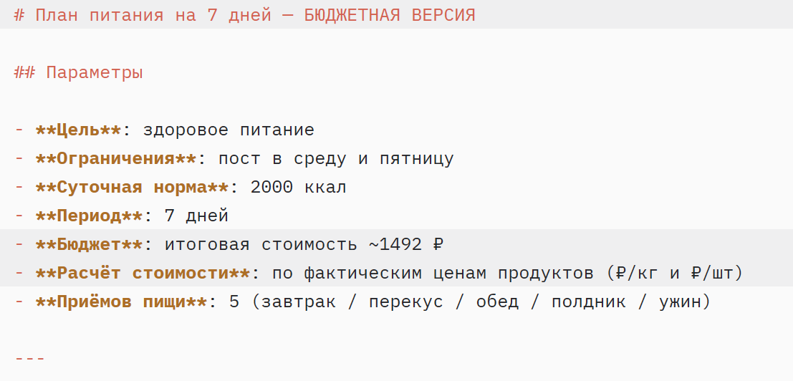
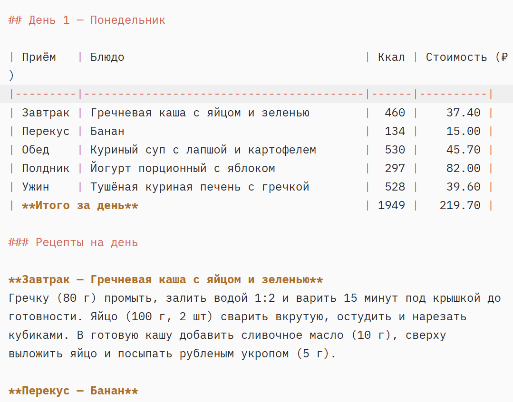
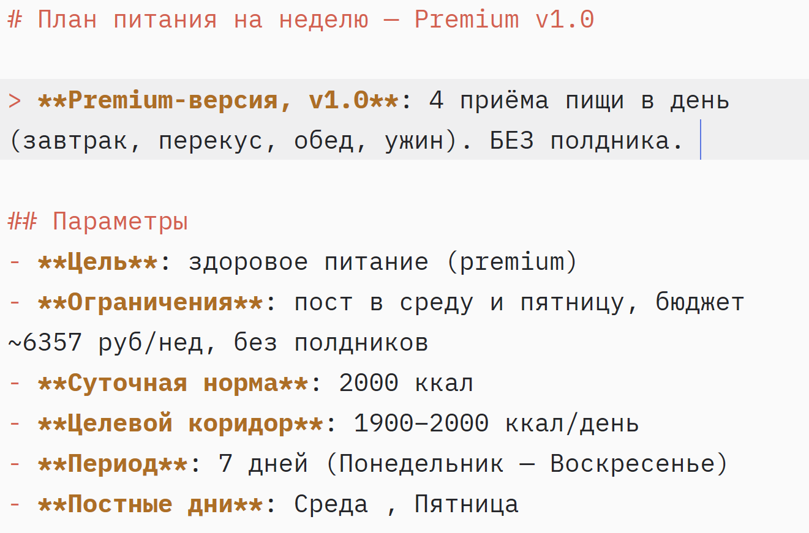
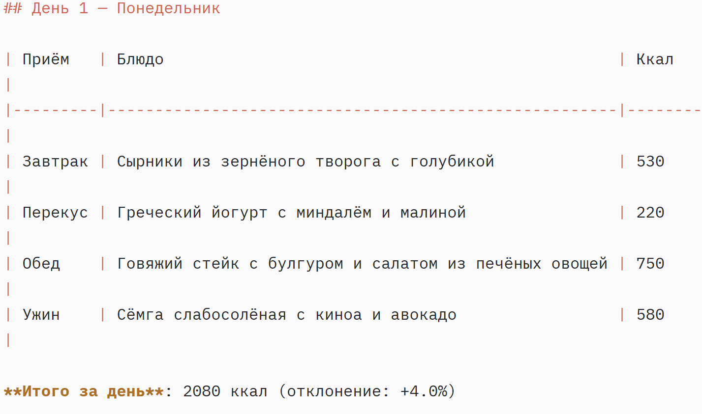

# 🍽️ AI Meal Planner

> **Умный планировщик питания на неделю, который считает калории, БЖУ и бюджет за вас.**

[](https://claude.com/claude-code)
[](https://python.org)
[](https://commonmark.org)
[](LICENSE)

---

## 🎯 Проблема

Составить сбалансированное меню на неделю — это **3–5 часов** возни с заметками, калькулятором и списком покупок. Нужно одновременно держать в голове:

- 📊 **Нормы КБЖУ** (≈ 2000 ккал/день, баланс белков-жиров-углеводов)
- 💰 **Бюджет** (рыночные цены на 50+ продуктов, пересчёт по граммовкам)
- 🛐 **Ограничения** (постные дни, аллергии, доступные продукты)
- 🔁 **Разнообразие** (чтобы не есть гречку 7 дней подряд)

Ошибка в одной цифре — и неделя продуктов идёт в мусорное ведро. **Ручной подсчёт отнимает часы и приводит к ошибкам.**

## 💡 Решение

**AI Meal Planner** — это AI-агент на базе Claude Code, который генерирует готовое меню на неделю за минуты. Вы задаёте параметры — получаете структурированный план питания с рецептами, расчётом КБЖУ и точным списком покупок до рубля.

Внутри:

- 🤖 **Claude Code** с кастомным субагентом `meal-planner` (диетолог-экономист)
- 🐍 **Python-скрипты** для точного пересчёта стоимости по прямым ценам ₽/кг и ₽/шт
- 📐 **Нормативная база ВОЗ** для расчёта суточной нормы КБЖУ
- 🍽️ **Две версии плана**: бюджетная и премиум — на выбор

## 👥 Для кого

- 🏃 **Занятые специалисты** — нет времени планировать, но хочется питаться правильно
- 👨‍👩‍👧 **Семьи** — нужно меню на всю неделю для нескольких человек
- 🥗 **Люди на диете** — точный контроль КБЖУ и калорий без ручного подсчёта
- 💸 **С ограниченным бюджетом** — прозрачный расчёт стоимости до копейки
- ✝️ **Верующие** — корректная поддержка постных дней (среда, пятница)

## ⚙️ Как работает

<details>
<summary><b>🔽 Входные параметры</b></summary>

Вы задаёте в одном запросе:

- 🎯 **Цель**: здоровое питание / снижение веса / набор массы
- 💰 **Бюджет на неделю** (₽)
- 🔥 **Суточная норма калорий** (по умолчанию 2000 ккал)
- 🚫 **Ограничения**: постные дни, аллергии, непереносимости
- 📅 **Срок**: 7 дней (можно больше)

</details>

<details>
<summary><b>🔽 Выходные файлы</b></summary>

Агент создаёт в папке `meal-plans/`:

- 📄 **`meal-plan-budget.md`** — бюджетное меню (≈ 1 500 ₽/неделя)
- 📄 **`meal-plan-premium.md`** — премиум-меню (≈ 5 000 ₽/неделя)
- 📦 **`*.json`** — те же данные в машиночитаемом виде

Каждый файл содержит:

- 🍳 Полное меню на 7 дней (завтрак, перекус, обед, ужин)
- 📊 КБЖУ каждого приёма пищи
- 📝 Рецепты с граммовками в скобках
- 🛒 Список продуктов на неделю с ценами
- 💰 Точную итоговую стоимость до рубля

</details>

## 🛠️ Технологии

| Слой | Стек |
|---|---|
| **AI-агент** | Claude Code (Opus 4) + кастомный субагент `meal-planner` |
| **Vibe-coding** | Быстрая итерация через диалог с агентом |
| **Расчёты** | Python 3.11+ (точные цены ₽/кг и ₽/шт) |
| **Хранение** | Markdown (для человека) + JSON (для машины) |
| **Кодинг-стиль** | Без фреймворков — только стандартные библиотеки |

## 📂 Структура репозитория

```
time-saver-ai/
├── meal-plans/                          # Готовые планы питания
│   ├── meal-plan-budget.md              # Бюджетная версия (≈ 1 500 ₽)
│   ├── meal-plan-budget.json            # Машиночитаемая версия
│   ├── meal-plan-premium.md             # Премиум-версия (≈ 5 000 ₽)
│   └── meal-plan-premium.json           # Машиночитаемая версия
│
├── reports/                             # Скрипты и отчёты
│   ├── recalc_budget_v3.py              # Точный пересчёт бюджетной версии
│   └── recalc_premium_v3.py             # Точный пересчёт Premium-версии
│
├── assets/                              # Скриншоты для README
│   ├── case-budget-header.png
│   ├── case-budget-day.png
│   ├── case-premium-header.png
│   └── case-premium-day.png
│
├── SKILL.md                             # Инструкции для AI-агента
├── claude.md                            # Конфигурация Claude Code
└── README.md                            # Этот файл
```

## 🖼️ Скриншоты

### Budget — план на неделю за ≈ 1 500 ₽





### Premium — план на неделю за ≈ 5 000 ₽





## 🔬 Методология

### Расчёт стоимости (v3 — прямые цены)

Каждый рецепт и каждая строка в списке покупок пересчитываются по формуле:

```
стоимость = (количество_г / 1000) × цена_₽_за_кг    # для весовых
стоимость = количество_шт × цена_₽_за_шт              # для штучных
стоимость = количество_мл × цена_₽_за_мл              # для жидкостей
```

Цены — единый источник истины в скрипте (`PRICE` dict). Суммы по приёмам пищи и по списку покупок **обязаны совпадать** (в пределах округлений).

### Нормы КБЖУ

- **Калории**: 2000 ккал/день (усреднённая норма ВОЗ для взрослого)
- **БЖУ**: 15% белки / 30% жиры / 55% углеводы
- **Постные дни**: среда и пятница (без мяса, рыбы, молочных продуктов животного происхождения)

Подробнее — в приложении каждого плана (`## Приложение: Методология и нормативная база`).

## 🚀 Быстрый старт

```bash
# 1. Клонировать репозиторий
git clone https://github.com/NinaKuskova/time-saver-ai.git
cd time-saver-ai

# 2. Открыть в Claude Code
claude

# 3. Запустить AI-агент запросом:
#    "Составь план питания на неделю, бюджет 5000 ₽, 2000 ккал/день, с постными днями"
```

## 🛣️ Roadmap

- [ ] **Интеграция с API магазинов** — автоматическая подстановка актуальных цен
- [ ] **Учёт аллергий и непереносимостей** — глютен, лактоза, орехи, морепродукты
- [ ] **Веб-интерфейс** — генерация плана через браузер без Claude Code
- [ ] **Экспорт в PDF** — для печати на холодильник
- [ ] **Telegram-бот** — план + список покупок каждое воскресенье
- [ ] **Генерация рациона на 14 / 30 дней** — с автоматической ротацией блюд
- [ ] **Учёт остатков в холодильнике** — не повторять то, что уже есть
- [ ] **Мультивалютная поддержка** — ₽, $, €, ¥ с автоматической конвертацией

## 📊 Сравнение версий

| Параметр               | 🟢 Budget | 🟡 Premium |
|------------------------|----------:|------------:|
| Приёмов пищи в день    |         5 |           4 |
| Стоимость в неделю     | ≈ 1 492 ₽ |   ≈ 4 991 ₽ |
| Стоимость в день       |   ≈ 213 ₽ |     ≈ 713 ₽ |
| Средняя калорийность   |2 000 ккал |  2 000 ккал |
| Постные дни            |✅ Включены|✅Включены  |
| Премиум-ингредиенты    |         ❌ | ✅ (сёмга, форель, пармезан) |
| Рецепты с граммовками  |        ✅ |         ✅ |

## 🤝 Вклад

Проект создан в vibe-coding-режиме с Claude Code. Если хотите улучшить:

1. 🍴 Форкните репозиторий
2. 🌿 Создайте ветку (`git checkout -b feature/amazing-feature`)
3. 💾 Закоммитьте изменения (`git commit -m 'Add amazing feature'`)
4. 📤 Запушьте ветку (`git push origin feature/amazing-feature`)
5. 🎁 Откройте Pull Request

## 📄 Лицензия

MIT — используйте, модифицируйте, распространяйте. Подробнее в [LICENSE](LICENSE).

## 👤 Автор

**Нина Кускова** — ИИ-специалист по автоматизации и архитектор агентных решений. Помогаю бизнесу и экспертам экономить время, внедряя AI-агентов на базе Claude Code.

- 📧 Email: [kuskova56@mail.ru](mailto:kuskova56@mail.ru)
- 💬 Telegram: [@Nika256](https://t.me/Nika256)
- 🌐 Сайт-портфолио: [Time Saver AI](https://venerable-begonia-22a4c4.netlify.app/)

---

<p align="center">
  <b>Сделано с 💚 и Claude Code</b><br>
  <sub>Если проект помог — поставьте ⭐️ на GitHub!</sub>
</p>
